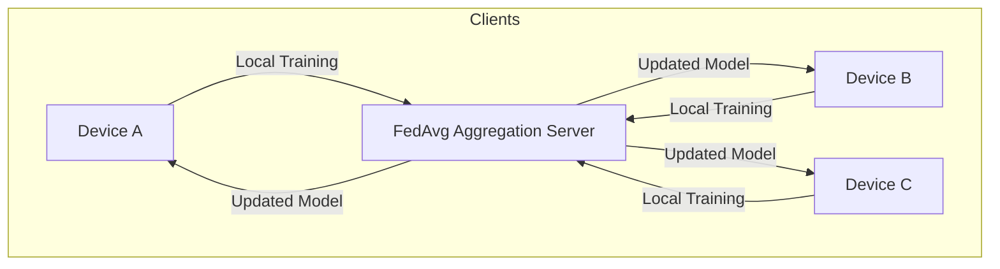
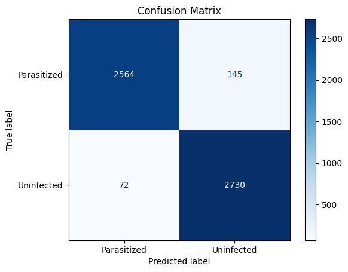

# 🦠 **Malaria Federated Learning on ICP Blockchain**

---

### 📌 Overview

**Federated Learning (FL)** is a machine learning paradigm focused on **data privacy** and **distributed intelligence**.

- 🔒 Keeps data **local** on edge devices (Temporary memory)
- 📡 Devices train **independently** and send **model updates(Stable memory)**  
- 🔁 Central server aggregates new model weights from every client using the **FedAvg algorithm** and updates the model weights in the central repository.




---

### 🎯 Motivation

> Malaria remains a persistent health crisis, particularly in **remote African regions** where:

- ❌ Diagnostic labs are scarce in deep remote settings.
- ❌ Scarcity of trained and certified labaratory personnel.
- ⚠️ Misdiagnoses are common—especially with low parasite loads or poor-quality blood smears  

---

#### 🔍 What drives this project?

- 🧪 Early-stage malaria is **hard to detect**  
- 🏥 Misdiagnosis leads to **avoidable fatalities**  
- 🤝 Personalized data from different clients will help **tailor AI diagnostics**  
- 📱 Edge devices in local clinics can **learn collaboratively** while preserving privacy  

> ⚡️ At MedCare, we envision **AI-powered diagnostic tools** in every remote clinic—resilient, privacy-aware, and **locally adapted.**

---

### 🧠 Model Training

> Since no suitable pretrained model existed, we built one from scratch using **EfficientNetV2** and **TensorFlow**.

> Of importance during the model training is enabling shuffling of the dataset to prevent overfitting cases. 

```python
IMG_SIZE = (224, 224)
BATCH_SIZE = 32

# Training dataset
train_ds = tf.keras.preprocessing.image_dataset_from_directory(
    "cell_images",
    validation_split=0.2,
    subset="training",
    seed=123,
    image_size=IMG_SIZE,
    batch_size=BATCH_SIZE,
    shuffle=True,
    label_mode='binary',
    interpolation='bilinear'
)

# Validation dataset
val_ds = tf.keras.preprocessing.image_dataset_from_directory(
    "cell_images",
    validation_split=0.2,
    subset="validation",
    seed=123,
    image_size=IMG_SIZE,
    batch_size=BATCH_SIZE,
    shuffle=True,
    label_mode='binary',
    interpolation='bilinear'
)
```

> 📈 **Results**:

The following classification report shows the model performance using 10 epochs for training on the validation set.

```text
              precision    recall  f1-score   support

    Parasitized       0.97      0.95      0.96      2709
     Uninfected       0.95      0.97      0.96      2802

       accuracy                           0.96      5511
      macro avg       0.96      0.96      0.96      5511
   weighted avg       0.96      0.96      0.96      5511
```

The model achieved a 96% accuracy on the test set.

- 📊 **Dataset**:  
  - Source: [NIH Malaria Dataset](https://data.lhncbc.nlm.nih.gov/public/Malaria/cell_images.zip)  
  - Classes: Infected vs. Uninfected blood cell images  

- 🔧 **Model Architecture**:  
  - Backbone: `MobileNetV3Small`  
  - Framework: `TensorFlow`  
  - Accuracy: ✅ **96%** on test set  
  - Exported as: `.safetensors` (~5MB)  


🧩 *Why MobilenetSmall?*

- 📦 Compact size — suitable for low-resource constraineddevices  
- 🚀 Optimized for inference speed and accuracy  
- 🧪 Proven performance on complex datasets like CIFAR 1000 which has 600 different classes of images 

---

### 🚀 AI Deployment on ICP Blockchain

The `Safetensor` model file is uploaded to the smart contract using the rust crate `ic-file-uploader` that uploads the model file in chunks. It uses a CLI *ic-file-uploader medAIml_backend append_openai_model_bytes malaria_mobilenetSmall.safetensors*. The `Config.json` file which is also the main powerhouse behind how the model generates predictions is also uploaded the same way(*ic-file-uploader medAIml_backend append_model_config_bytes config.json*) ensuring a good User Experience by only uploading the `Blood sample files` to get predictions. 

> The `Candle` rust crate depends on the `getrandom` rust crate which is not supported in Blockchain. To get around this, we do the following:
1. Adjust the dfx.json file to include the following code:

```json
  "type": "custom",
      "build": [
        "RUSTFLAGS='--cfg getrandom_backend=\"custom\"' cargo build --target wasm32-unknown-unknown --release -p medAIml_backend"
      ],
```

2. Create a new `.cargo\config.toml` directory in the root directory of the project having the following code:
```toml
[build]
rustflags = ["--cfg", "getrandom_backend=\"custom\""]
target = "wasm32-unknown-unknown"
```

3. Create a custom getrandom function to handle the error in te `lib.rs` file containing the following code:

```rust
use getrandom::Error;

#[no_mangle]
unsafe extern "Rust" fn __getrandom_v03_custom(
    dest: *mut u8,
    len: usize,
) -> Result<(), Error> {
    for i in 0..len {
        *dest.add(i) = 0; 
    }
    Ok(())
}
```

> The model is deployed to a **WebApplication** powered by:

- ⚙️ **Rust** + **WASM** backend  
- 🌐 **React**  
- 🔗 **ICP Blockchain** for secure and decentralized hosting  

#### 🌍 User Flow:

1. User uploads a blood sample.
2. Model predicts if the sample is infected or not.


#### 📁 Source Files:
- 🧠 `agent.rs`: FedAvg aggregation logic  
- 🛠 `Lib.rs`: Main ingestion file
- 📄 `client.rs`: Model initialization & runtime
- 📄 `storage.rs`: Model weights storage implementation
- 📄 `config.json`: Model configuration


---

### 🔄 Federated Learning Cycle

1. Clients perform local training  
2. Model weights sent to central server  
3. Server averages weights (FedAvg)  
4. Updated model sent back to clients  

---

### 🌍 Why Federated Learning?

✅ Enables learning from **diverse regions**  
✅ Avoids sharing **raw patient data**  
✅ Supports **personalized AI** tuned for different environments  
✅ Ideal for **low-resource** rural health centers  

---

### 🎯 Impact Goal

> By decentralizing learning and deploying AI on **edge devices**, we aim to:

- 💉 Improve diagnostic accuracy  
- 🌍 Reach underserved populations  
- 🔒 Preserve patient data privacy  
- 🤖 Build a smarter, collaborative malaria detection ecosystem  

---

### 📎 Future Enhancements

- 🩺 Add **explainable AI (XAI)** features  
- 📊 Monitor real-time model drift and retraining cycles  
- 🌐 Connect multiple clinics via blockchain nodes  

---

### 📫 Contributing / Questions?

If you'd like to contribute, suggest features, or ask questions — feel free to open an issue or reach out!

---
