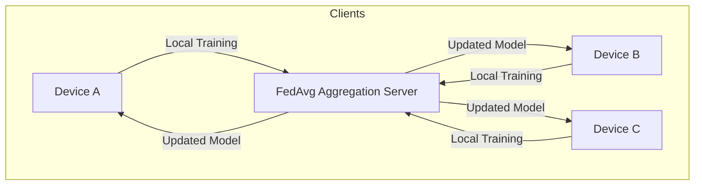

# 🦠 **Malaria Federated Learning on ICP Blockchain**

---

### 📌 Overview

**Federated Learning (FL)** is a machine learning paradigm focused on **data privacy** and **distributed intelligence**.

- 🔒 Keeps data **local** on edge devices (Temporary memory)
- 📡 Devices train **independently** and send **model updates(Stable memory)**  
- 🔁 Central server aggregates new model weights from every client using the **FedAvg algorithm** and updates the model weights in the central repository.


```mermaid
flowchart TD
    subgraph Clients
        A[Device A] -->|Local Training| S
        B[Device B] -->|Local Training| S 
        C[Device C] -->|Local Training| S
    end

    S[FedAvg Aggregation Server]
    S -->|Updated Model| A
    S -->|Updated Model| B
    S -->|Updated Model| C
```


---

### 🎯 Motivation

> Malaria remains a persistent health crisis, particularly in **remote African regions** where:

- ❌ Diagnostic labs are scarce in deep remote settings.
- ❌ Scarcity of trained and certified labaratory personnel.
- ⚠️ Misdiagnoses are common—especially with low parasite loads or poor-quality blood smears  

---

#### 🔍 What drives this project?

- 🧪 Early-stage malaria is **hard to detect**  
- 🏥 Misdiagnosis leads to **avoidable fatalities**  
- 🤝 Personalized data from different clients will help **tailor AI diagnostics**  
- 📱 Edge devices in local clinics can **learn collaboratively** while preserving privacy  

> ⚡️ At MedCare, we envision **AI-powered diagnostic tools** in every remote clinic—resilient, privacy-aware, and **locally adapted.**

---

### 🧠 Model Training

> Since no suitable pretrained model existed, we built one from scratch using **MobileNetV3Small** and **TensorFlow**.
>
> Data was downloaded from the tensorflow datahub which directly downloads the malaria blood cell imagesdirectly from the `NIH-NLM` website and loaded from memory using tensorflow. Enabling data shuffling across both the training and validation sets ensures the model does not suffer from class imbalance.
>
```python
IMG_SIZE = (224, 224)
BATCH_SIZE = 32

# Training dataset
train_ds = tf.keras.preprocessing.image_dataset_from_directory(
    "cell_images",
    validation_split=0.2,
    subset="training",
    seed=123,
    image_size=IMG_SIZE,
    batch_size=BATCH_SIZE,
    shuffle=True,
    label_mode='binary',
    interpolation='bilinear'
)

# Validation dataset
val_ds = tf.keras.preprocessing.image_dataset_from_directory(
    "cell_images",
    validation_split=0.2,
    subset="validation",
    seed=123,
    image_size=IMG_SIZE,
    batch_size=BATCH_SIZE,
    shuffle=True,
    label_mode='binary',
    interpolation='bilinear'
)
```

- 📊 **Dataset**:  
  - Source: [TFDS Malaria Dataset](https://data.lhncbc.nlm.nih.gov/public/Malaria/cell_images.zip)  
  - Classes: Infected vs. Uninfected blood cell images  

- 🔧 **Model Architecture**:  
  - Backbone: `EfficientNetV2`  
  - Framework: `TensorFlow`  
  - Accuracy: ✅ **94.5%** on test set  
  - Exported as: `.safetensors` (~5MB)  


🧩 *Why MobileNetV3Small?*

- 📦 Compact size — suitable for low-resource devices  
- 🚀 Optimized for inference speed and accuracy  
- 🧪 Proven performance on complex datasets like CIFAR 1000 which has 600 different classes of images 

---

### 🚀 AI Deployment on ICP Blockchain

The `Safetensor` model file is uploaded to the smart contract using a rust crate called `ic-file-uploader` that uploads the model in chunks. The `Config.json` file which is also the main powerhouse behind how the model operates is also uploaded the same way ensuring a user only uploads the `Blood sample files` to get predictions. 

> The model is deployed to a **WebApplication** powered by:

- ⚙️ **Rust** + **WASM** backend  
- 🌐 **React**  
- 🔗 **ICP Blockchain** for secure and decentralized hosting  

#### 🌍 User Flow:


#### 📁 Source Files:
- 🧠 `agent.rs`: FedAvg aggregation logic  
- 🛠 `main.rs`: Model initialization & runtime  

---

### 🔄 Federated Learning Cycle

1. Clients perform local training  
2. Model weights sent to central server  
3. Server averages weights (FedAvg)  
4. Updated model sent back to clients  
5. Repeat  

---

### 🌍 Why Federated Learning?

✅ Enables learning from **diverse regions**  
✅ Avoids sharing **raw patient data**  
✅ Supports **personalized AI** tuned for different environments  
✅ Ideal for **low-resource** rural health centers  

---

### 🎯 Impact Goal

> By decentralizing learning and deploying AI on **edge devices**, we aim to:

- 💉 Improve diagnostic accuracy  
- 🌍 Reach underserved populations  
- 🔒 Preserve patient data privacy  
- 🤖 Build a smarter, collaborative malaria detection ecosystem  

---

### 📎 Future Enhancements

- 🩺 Add **explainable AI (XAI)** features  
- 📊 Monitor real-time model drift and retraining cycles  
- 🌐 Connect multiple clinics via blockchain nodes  

---

### 📫 Contributing / Questions?

If you'd like to contribute, suggest features, or ask questions — feel free to open an issue or reach out!

---
